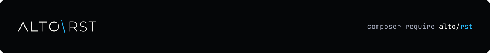

<h1 align="center">
  <a href="https://altophp.com/rst">
    
  </a>
</h1>

ALTO RST parses reStructuredText into the ROM, a source-positioned object
model you can lint, format, edit, and convert to safe HTML, preserving
everything you don't touch.

<p align="center">
  
  
  <a href="https://packagist.org/packages/alto/rst"></a>
  
  <a href="https://github.com/sponsors/smnandre"></a>
</p>

The core has no runtime Composer dependencies. It supports docutils RST,
Sphinx syntax, and the conventions used by Symfony documentation. Trusted
extensions can add directives, roles, lint rules, fixes, formatter passes,
statistics, and conversion mappings.

The full guide set lives under [`docs/`](docs/index.md).

| Need | Start with |
| --- | --- |
| Convert RST to safe HTML | `Rst::sphinx()->toHtml($source)` |
| Parse and inspect a document | `Rst::sphinx()->parse($source)` |
| Inspect targets and references | `$result->references()` |
| Lint a document | `Linter::lint()` |
| Fix, format, or edit source | `FixEngine`, `Formatter`, and `Editor` |
| Convert RST and Markdown | `RstToMarkdown` and `MarkdownToRst` |
| Convert a documentation directory | `ProjectConverter::convertDirectory()` |
| Add trusted behavior | `Profile::withExtension()` |

## Quick Start

```php
use Alto\Rst\Rst;

$source = "Run ``composer install``.\n";
$html = Rst::sphinx()->toHtml($source);
```

The result is:

```html
<p>Run <code>composer install</code>.</p>
```

Direct rendering is the shortest path when HTML is the only result you need.
Output is safe by default: text is escaped, unsafe URL schemes are filtered,
and file-reading directives stay disabled.

Choose the narrowest profile that matches the source:

```php
Rst::docutils();
Rst::sphinx();
Rst::symfony();
```

See [Installation](docs/installation.md), [Parsing](docs/parsing.md),
[Rendering](docs/rendering.md), and [Security](docs/security.md) for
setup, profile, and rendering policies.

## Installation

Install ALTO RST with Composer:

```bash
composer require alto/rst
```

ALTO RST requires PHP 8.4 or later. No Python or Sphinx process is involved at runtime.

## Parse a document when you need more

Parsing keeps the document tree, original byte positions, references, and
recovery problems available for later operations:

```php
use Alto\Rst\Rst;

$source = <<<'RST'
    .. _installation:

    Installation
    ============

    Read the :ref:`installation` section.
    RST;

$result = Rst::sphinx()->parse($source);

$document = $result->document();
$parserProblems = $result->problems();
$references = $result->references();
$referenceProblems = $references->problems();
```

Malformed input recovers into typed parser problems instead of losing source
text. Reference resolution has its own report, so syntax recovery and broken
document links remain distinguishable.

The same parsed model powers linting, project-wide reference resolution,
source-preserving edits, and conversion. Maintenance operations return exact
patches before anything is saved. Project conversion discovers `.rst` files
recursively, resolves cross-document Sphinx links, and aggregates every
unsupported, lossy, or approximate mapping for review.
Resolved footnotes, citations, and substitutions have explicit Markdown
mappings, including collision-safe anchors across expanded include files.
Code fence language names such as `html+twig` remain unchanged.

The documentation covers this in more depth: [Linting](docs/linting.md)
to run and configure the recommended rules, [Conversion](docs/conversion.md)
to convert individual documents or complete projects between RST and Markdown,
and [Editing](docs/editing.md) for conservative fixes,
formatting, typed edits, diffs, and conflict-safe file persistence.

## Extend

Trusted extensions add directives, roles, lint rules, fixes, formatter
passes, statistics, and conversion mappings through compiled profile
contracts. Read [Extensions](docs/extensions.md) for the extension contracts
and [References](docs/references.md) for how local and project-wide
targets, links, notes, citations, and substitutions resolve.

## Documentation

- [Installation](docs/installation.md) and [Getting started](docs/getting-started.md)
- [Parsing](docs/parsing.md) and [Rendering](docs/rendering.md)
- [Linting](docs/linting.md) and [Editing](docs/editing.md)
- [Conversion](docs/conversion.md) and [References](docs/references.md)
- [Extensions](docs/extensions.md), [Security](docs/security.md), and
  [Errors](docs/errors.md)

The [documentation index](docs/index.md) lists these pages in site navigation
order and links their focused guides.

## Contributing

Contributions of all kinds are welcome. Visit the
[project on GitHub](https://github.com/altophp/rst) to
[report a bug](https://github.com/altophp/rst/issues/new),
[suggest a feature](https://github.com/altophp/rst/issues/new), or
[open a pull request](https://github.com/altophp/rst/pulls).

Before submitting code, run:

```bash
# Runs PHP CS Fixer, PHPStan, and PHPUnit
composer qa
```

Changes to public behavior should include tests and documentation.

Run `composer coverage` separately to enforce the 97% line-coverage floor.
The suite uses a pinned docutils 0.23 fixture corpus and does not run Python or
Sphinx. Set `ALTO_RST_UX_CORPUS` to a Symfony UX checkout to enable the optional
corpus conversion tests.

## Support

ALTO RST is open source and independently maintained by
[Simon André](https://smnandre.dev). If it is useful to your work, you can
support its continued development through
[GitHub Sponsors](https://github.com/sponsors/smnandre).

Sharing the package or
[starring it on GitHub](https://github.com/altophp/rst) also helps.

## License

ALTO RST is released by [ALTO PHP](https://altophp.com) under the
[MIT License](LICENSE).
